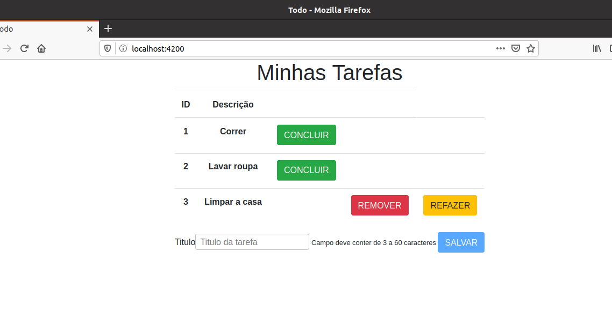

# ToDo List com Angular

Projeto para aprendizagem do Framework Angular. Todo passo a passo de construção foi inspirado no curso do Angular feito por André Baltieri em seu canal no [Youtube](https://www.youtube.com/playlist?list=PLHlHvK2lnJneQPfbOvUait1MtAoXeYhtL).

## Imagem

